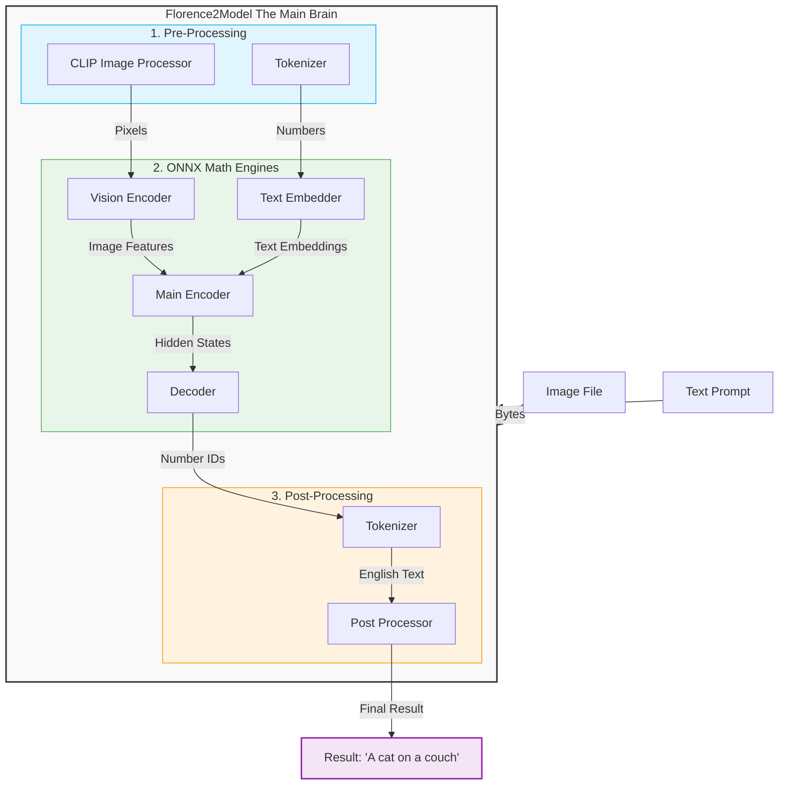

# Florence-2 C++ Local Engine: Project Overview

This document provides a high-level, technical overview of the Florence-2 C++ port. Its purpose is to explain the architecture and core execution flow of the system for developers and contributors who wish to understand the engine before diving into the source code.

---

## 1. What is this project?

This project is a standalone, C++ application that executes Microsoft's Florence-2 Vision-Language AI model locally using CPU inference. 

Florence-2 is a versatile vision-language model capable of image captioning, object detection, optical character recognition (OCR), and visual question answering. By utilizing ONNX Runtime, this project removes the dependency on Python environments (like PyTorch) and cloud GPUs, enabling the model to run efficiently on edge devices and consumer hardware.

## 2. Architecture and Data Flow

At a high level, the system translates user inputs (images and text) into mathematical tensors, processes them through four specialized ONNX models, and decodes the resulting tensors back into natural language.

The following architecture diagram illustrates the end-to-end execution flow:

### Step A: Preprocessing
1. **The Tokenizer:** The text prompt is tokenized using a Byte-Pair Encoding (BPE) algorithm to convert the string into a sequence of integer IDs.
2. **The Image Processor:** The input image is resized, center-cropped, and normalized using predefined mean and standard deviation values. The resulting pixels are flattened into a multidimensional float array.

### Step B: Core ONNX Execution
The core mathematical operations are handled by four ONNX sessions:

1. **Text Embedder:** Converts the tokenized integer IDs into 768-dimensional dense vectors.
2. **Vision Encoder:** Extracts visual features from the normalized pixel array, mapping them into the same 768-dimensional latent space.
3. **The Main Encoder:** Concatenates the text and vision embeddings and processes them through multiple self-attention layers. This fuses the spatial and semantic context into a unified representation.

### Step C: Autoregressive Decoding
The final stage is an autoregressive generation loop:
- **The Decoder:** Accepts the fused representations from the Main Encoder and a start token `</s>`. It outputs a probability distribution (logits) for the next token and a KV cache for optimization.
- **Generation Loop:** The highest probability token is selected, appended to the sequence, and fed back into the decoder. This process repeats until an end-of-sequence token is generated or the maximum length is reached.
- **Post-Processing:** The generated token IDs are decoded back into a human-readable string and formatted to produce the final result.

---

## 3. Next Steps

For detailed instructions on compiling the binaries, downloading the ONNX models, and running test inferences, please refer to the `README.md` file in the project root.
